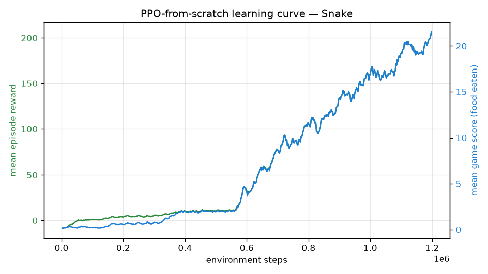

<!-- Progression GIFs are added at the top once training has produced them. -->
<p align="center">
  
</p>

<h1 align="center">🐍 rl-agent-arcade</h1>

<p align="center">
  <b>Proximal Policy Optimization, implemented from scratch, learning to master Snake.</b><br/>
  Custom Gymnasium environment · hand-written PPO (GAE + clipped objective) · live demo.
</p>

<p align="center">
  <a href="#quickstart">Quickstart</a> ·
  <a href="#results">Results</a> ·
  <a href="#how-it-works">How it works</a> ·
  <a href="#what-i-learned">What I learned</a>
</p>

---

## The one-sentence pitch

Snake is a small game with a deceptively hard credit-assignment problem: the only
truly meaningful rewards (eat / die) are sparse. This repo trains an agent to
play it well with **PPO written by hand** — no `model.fit()` — and packages the
whole thing as a reproducible pipeline: custom environment → training →
evaluation → progression GIFs → live demo.

## Progression: random → mid-training → expert

| Random policy | Mid-training | Expert (trained) |
| :---: | :---: | :---: |
|  |  |  |
| bumps into walls | starts chasing food | eats efficiently, avoids itself |

## Results

<!-- METRICS:START -->
Trained for **1.2M environment steps (~10 min on a single CPU core)**, evaluated
with the greedy policy over **100 episodes** on a 12×12 grid:

| Metric (100 eval episodes) | Random policy | **PPO from scratch** |
| --- | :---: | :---: |
| Mean game score (food eaten) | 0.06 | **22.53** |
| Max score in a single game | 1 | **37** |
| Mean episode reward | −9.51 | **+218.13** |
| Mean episode length (steps survived) | 30 | **368** |

**~375× the random policy's mean score**, going from "dies almost immediately"
to filling roughly a quarter of the board. The takeoff is clearly visible in the
learning curve below, around 550k steps.
<!-- METRICS:END -->



## Live demo

A Gradio app where you can watch the agent play in the browser: `python demo/app.py`
(deployable as-is to Hugging Face Spaces — see [Deploying the demo](#deploying-the-demo)).

## How it works

```
            ┌─────────────────┐   action    ┌──────────────────────────┐
            │   SnakeEnv       │◀───────────│   PPO (from scratch)      │
            │  (Gymnasium API) │            │  actor-critic MLP         │
            │  11-dim features │──────────▶ │  GAE + clipped objective  │
            └─────────────────┘  obs, reward└──────────────────────────┘
```

### The environment (`envs/snake_env.py`)

* **Observation — 11-dim feature vector**, not pixels: three danger sensors
  (collision straight / right / left), the current direction as a one-hot, and
  the relative direction of the food. This lets a small MLP learn in minutes on
  CPU; pixels would need a CNN and hours.
* **Action space — 3 relative actions** (go straight, turn right, turn left).
  This makes an instant 180° reversal impossible *by construction*, removing a
  whole class of self-inflicted deaths early in training.
* **Reward shaping** (documented on purpose — it's the single biggest lever):

  | event | reward |
  | --- | --- |
  | eat food | **+10** |
  | die (wall / self) | **−10** |
  | move closer to food | **+0.01** |
  | move away from food | **−0.015** |

  The dense term turns an almost-sparse problem into one with a gradient to
  follow every step. The away-malus is slightly larger than the toward-bonus so
  aimless looping has a small net cost.

### The algorithm (`agents/ppo_scratch.py`)

Everything is hand-written and auditable:

* **Actor-critic** with a shared MLP trunk (`agents/networks.py`), orthogonal
  init, tanh activations.
* **Generalized Advantage Estimation (GAE)** computed with a backward pass over
  each rollout.
* **Clipped surrogate objective** —
  `L_CLIP = E[min(rₜ·Aₜ, clip(rₜ, 1−ε, 1+ε)·Aₜ)]` — the heart of PPO.
* **Entropy bonus** to keep exploring, **value loss**, **advantage
  normalisation**, **gradient clipping**, and **multiple epochs of minibatch
  updates** per rollout.

**Baseline for comparison:** the same environment is also trained with
Stable-Baselines3's PPO (`agents/baseline_sb3.py`). SB3 is used *only* as an
objective reference — if a battle-tested implementation solves the task, the
environment is sound and the from-scratch agent has no excuse.

## Repository layout

```
rl-agent-arcade/
├── envs/snake_env.py          # custom Snake environment (Gymnasium API)
├── agents/
│   ├── ppo_scratch.py         # PPO from scratch — the core of the project
│   ├── networks.py            # actor-critic MLP
│   └── baseline_sb3.py        # Stable-Baselines3 baseline (comparison only)
├── training/train.py          # training loop, TensorBoard logging, checkpoints
├── training/configs/          # YAML hyperparameters
├── evaluation/
│   ├── evaluate.py            # quantitative eval vs random baseline
│   ├── record_video.py        # progression GIFs
│   └── plot_curves.py         # learning-curve PNG from TensorBoard logs
├── demo/app.py                # Gradio live demo
├── tests/test_snake_env.py    # unit tests (12, all passing)
└── notebooks/analysis.ipynb   # analysis & comparison
```

## Quickstart

```bash
python -m venv .venv
. .venv/Scripts/activate            # Windows  (Linux/macOS: source .venv/bin/activate)
pip install -r requirements.txt

pytest -q                           # 1. validate the environment (12 tests)

# 2. train PPO from scratch (~10 min on CPU)
python -m training.train --config training/configs/snake_ppo.yaml

# 3. evaluate against a random baseline
python -m evaluation.evaluate --checkpoint checkpoints/best_model.pt --episodes 100

# 4. build the progression GIFs
python -m evaluation.record_video --random --out media/random_agent.gif
python -m evaluation.record_video --checkpoint checkpoints/ckpt_update_00050.pt --out media/mid_training_agent.gif
python -m evaluation.record_video --checkpoint checkpoints/best_model.pt --out media/expert_agent.gif

# 5. learning curve + live demo
python -m evaluation.plot_curves --logdir runs/snake_ppo_main --out media/learning_curve.png
python demo/app.py

# monitor training live:
tensorboard --logdir runs
```

## What I learned

* **Reward shaping is where most of the behaviour comes from.** With sparse
  eat/die rewards only, the agent barely learns on a 12×12 grid within the CPU
  budget; adding the small distance-shaping term is what makes it take off.
* **Removing the 180° reversal via a relative action space** eliminated a huge
  fraction of early deaths and stabilised the whole run.
* **The PPO details that "don't matter" until they do:** advantage
  normalisation, orthogonal init with a small gain on the policy head, and
  gradient clipping each moved training from unstable to smooth.
* **A trusted baseline is a debugging tool.** Getting SB3 to learn the env first
  meant that when my from-scratch agent misbehaved, I knew to look at my PPO
  code, not the environment.

## Deploying the demo

The `demo/` folder is a self-contained Gradio app. To publish it on
[Hugging Face Spaces](https://huggingface.co/spaces) (free):

1. Create a new Space → SDK **Gradio**.
2. Upload `demo/app.py` (as `app.py`), `demo/requirements.txt`, the `envs/` and
   `agents/` packages, and `checkpoints/best_model.pt`.
3. The Space builds and serves the live demo automatically.

## Roadmap

* Atari Breakout in the same framework (same PPO, CNN instead of MLP).
* PPO vs DQN vs A2C on the same environment.
* Ablation study on reward shaping (dense vs sparse-only).
* Curriculum learning (grid that grows over training).

## License

[MIT](LICENSE)
